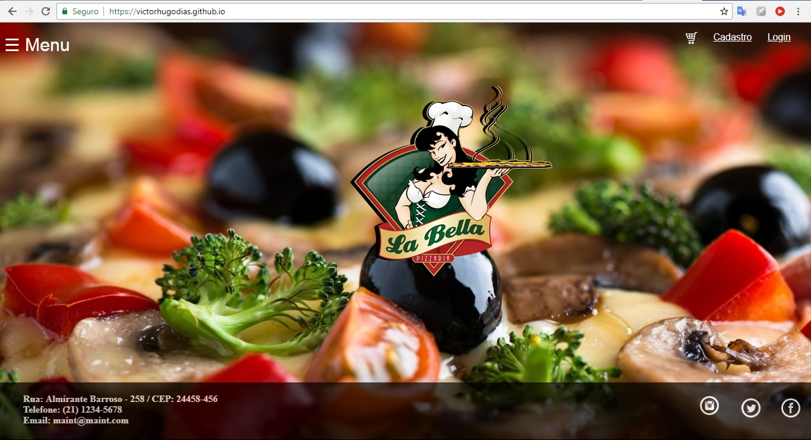

## Projeto desenvolvido para Faculdade Infnet avaliar competências do aluno.  
### Sistema web desenvolvido utilizando as ferramentas HTML / CSS / JAVASCRIPT.  
### 1. Desenvolver uma pizzaria online que seja responsiva e utilize html , css e javaScript.  
### Fotos do Sistema Web

